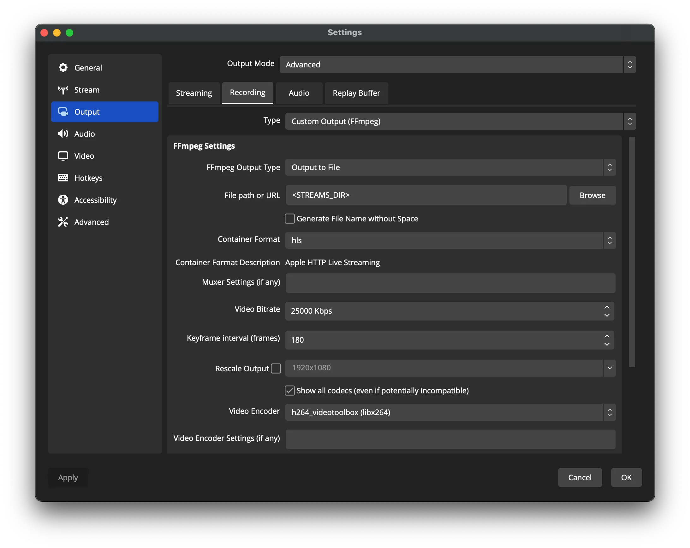
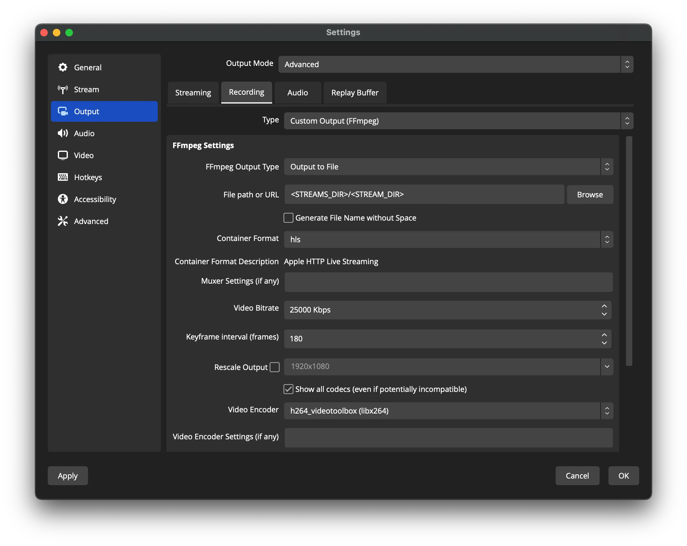

# HLSsimple

## Installation

```shell
cargo install --git https://github.com/ivabus/hlssimple
```

## Usage

```shell
hlssimple --stream-dir <STREAMS_DIR>
```

Where `STREAMS_DIR` contains raw (>= 1) streams (.m3u8 file name will be used for index), or streams contained in subdirs (subdir name will be used to index).

## OBS Configuration

| All streams in one dir                   | Streams split by subdirs                              |
|------------------------------------------|-------------------------------------------------------|
|  |  |
